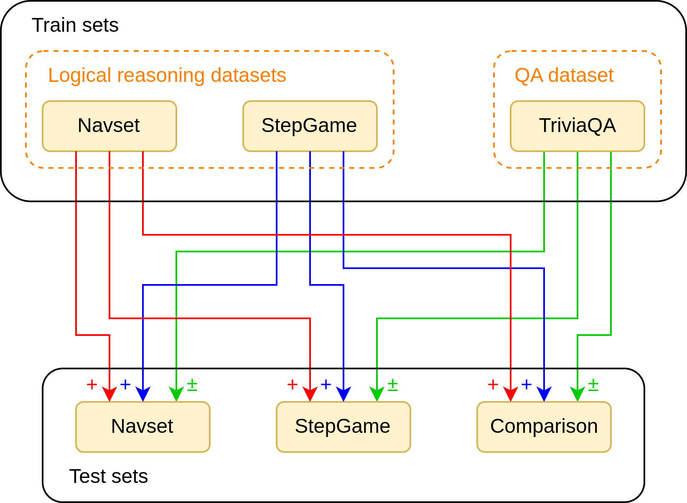

# Multi-hop Reasoning
The official implementation code of the paper "Improving Multi-hop Logical Reasoning in Small LMs with LoRA Training" [(Link)](https://journals.flvc.org/FLAIRS/article/view/138643/144062).

## Methodology



## Usage

- Run navset_lora_train.py to train the models.

```
python navset_lora_train.py --model_name meta-llama/Llama-3.1-8B-Instruct
```

- Run navset_lora_test.py and navset_quan_test.py for testing. The LoRA models should be in the same folder.

```
python navset_lora_test.py --model_name meta-llama/Llama-3.1-8B-Instruct --train_dataset navset
```

```
python navset_quan_test.py --model_name meta-llama/Llama-3.1-8B-Instruct
```

- Run navset_facts.py for evaluation:

```
python navset_facts.py --model_name meta-llama_Llama-3.1-8B-Instruct_navset_lora
```
